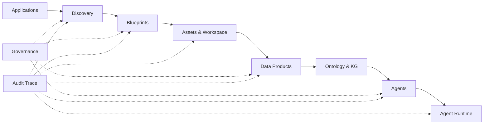

# Semantic Intelligence Platform (SIP)

**Turn enterprise data into governed, explainable semantic intelligence — from discovery to agents.**

SIP is a modular, cloud-native platform that guides organizations through the full **Semantic Intelligence lifecycle**: structured discovery, blueprint-driven provisioning, curated data products, ontology-backed knowledge graphs, and policy-governed AI agents. Every significant action is traceable via **Semantic Transactions** and **Trace Steps**, so outcomes stay auditable and explainable by design.

---

## Why SIP?

Modern data platforms often ship disconnected pipelines and opaque AI wrappers. SIP takes a different path:

| Principle | What it means in practice |
|-----------|---------------------------|
| **Blueprint before provisioning** | Nothing is provisioned blindly — a reviewed Blueprint defines what gets built |
| **Products, not raw tables** | Agents and consumers work with **Published Data Products**, not ad-hoc SQL |
| **Explainability by construction** | Discovery, provisioning, and agent runs emit semantic audit trails |
| **Technology independence** | Business logic talks to **ports** (storage, KG, vectors, LLM) — not vendor SDKs |
| **Governed delivery** | Architecture-first sprints, ADRs, and sprint-close quality gates |

---

## Platform lifecycle



---

## What's in the monorepo

| Path | Purpose |
|------|---------|
| [`backend/`](backend/) | Python / FastAPI modular monolith — REST API at `/api/v1` |
| [`frontend/`](frontend/) | React / TypeScript Platform Console (MVP in progress) |
| [`infra/`](infra/) | Kubernetes + Kustomize — primary runtime (`sip-dev` namespace) |
| [`architecture/`](architecture/) | Canonical architecture specifications |
| [`docs/`](docs/) | ADRs, governance, retros, and engineering playbooks |
| [`scripts/`](scripts/) | Sprint verification, board sync, and approved automation |

### Backend modules (MVP)

`applications` · `discovery` · `blueprints` · `assets` · `audit_trace` · `products` · `agents` · `ontology` · `knowledge_graph` · `adapters` · `agent_runtime` · `governance`

---

## Tech stack

- **API:** FastAPI, Pydantic, Alembic (PostgreSQL)
- **Architecture:** Modular monolith, Ports & Adapters (hexagonal)
- **Runtime:** Kubernetes-first (ADR-001); local dev via `sip-dev` + port-forward
- **Integrations (via adapters):** PostgreSQL, MinIO, Fuseki, Qdrant, OpenMetadata, OpenAI

---

## Quick start

```bash
# Clone and enter the repo
git clone https://github.com/utkanbir/Semantic-Intelligence-Platform.git
cd Semantic-Intelligence-Platform

# Backend (see backend/README.md for SIP_* env vars)
cd backend
pip install -e ".[dev]"
alembic upgrade head
uvicorn app.main:app --reload

# Kubernetes dev cluster — see infra/README.md
kubectl apply -k infra/kubernetes/overlays/dev
```

Health check: `GET /api/v1/health`

---

## Documentation

| Document | Description |
|----------|-------------|
| [Development Playbook](docs/project/SIP_DEVELOPMENT_PLAYBOOK.md) | Engineering process, quality gates, team conventions |
| [GitHub Workflow](docs/project/SIP_GITHUB_WORKFLOW.md) | Issues, sprints, milestones, delivery workflow |
| [ADR-001: Cloud Native Deployment](docs/adr/ADR-001-cloud-native-deployment-strategy.md) | Kubernetes-first runtime strategy |
| [Governance](docs/governance/README.md) | Decision authority, architecture gates, sprint retros |
| [Backend README](backend/README.md) | API modules, configuration, migrations |
| [Infra README](infra/README.md) | Cluster setup, deploy, port-forward |

---

## Project status

SIP MVP is under active sprint delivery on the `develop` integration branch.

| Milestone | Status |
|-----------|--------|
| Foundation & Applications (Sprint 0–1) | ✅ Closed |
| Discovery & Blueprint (Sprint 2–3) | ✅ Closed |
| Assets & Audit Trace (Sprint 4) | ✅ Closed |
| Products & Agents (Sprint 5–6) | ✅ Closed |
| Ontology & Knowledge Graph (Sprint 7) | ✅ Closed |
| Adapters & Agent Runtime (Sprint 8) | ✅ Closed |
| Governance (Sprint 9) | ✅ Closed |
| Assessment MVP E2E (Sprint 10) | ✅ Closed |
| Platform Console (Sprint 11) | ✅ Closed |

**Current:** 188 pytest · 10 frontend vitest · Alembic `20260629_0015` · Console at `frontend/` (local dev)

---

## Contributing

Work is tracked in GitHub Issues and the **SIP MVP Delivery** project board. See [SIP GitHub Workflow](docs/project/SIP_GITHUB_WORKFLOW.md) for issue templates, sprint milestones, and PR standards. Architecture changes require ADR review — implementation follows frozen MVP specs in `architecture/`.

---

## License

See repository license file for terms.
