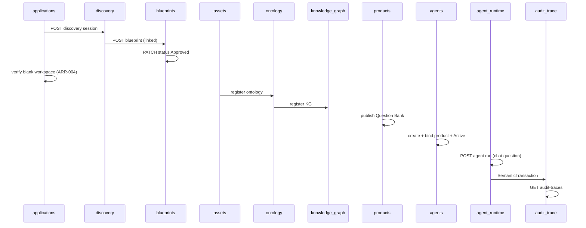

# Assessment MVP E2E Scenario Contract v1

**Status:** Authoritative supplement (Sprint 10)  
**Date:** 2026-06-29  
**Issue:** S10-01 (#148)  
**Architecture references:** ARR-001, ARR-002, ARR-004, D-003, R-007, R-011, R-012, R-013, R-014  
**Companion:** [SIP_Architecture_Review_Resolution_v1.md](./SIP_Architecture_Review_Resolution_v1.md)

---

## 1. Purpose

Define the **cross-module Assessment MVP regression scenario** that Sprint 10 E2E integration tests must implement before **gate = Yes** Assessment E2E PRs merge to `develop`.

Binding for:

- Nine-step demo flow from `SIP_MVP_Scope_v0_1` / playbook §13
- REST API call sequence and expected status codes
- Lifecycle transitions per module contracts
- SemanticTransaction expectations (R-013)
- ARR-004 blank workspace verification (no auto semantic assets)

---

## 2. Scope

| In scope | Out of scope |
|----------|--------------|
| API-level E2E via pytest + TestClient | Platform Console UI |
| In-memory sqlite test harness (S10-02) | Live LLM / physical adapter calls |
| Stub agent run as “application chat” | MCP external APIs |
| Trace listing via `/api/v1/audit-traces` | TraceStep orchestration ADR (TD-006) |
| Question Bank as PublishedDataProduct | Automatic Blueprint → product generation |

---

## 3. Scenario overview

**Application key:** `assessment-mvp` (or unique suffix in tests)  
**Actor:** `assessment-analyst`  
**Outcome:** Full lifecycle exercised; audit traces retrievable for significant writes and agent run.

---

## 4. Step-by-step contract

### Step 1 — Create Assessment Application

| Item | Value |
|------|-------|
| **Endpoint** | `POST /api/v1/applications` |
| **Body** | `{ "key": "assessment-mvp", "name": "Assessment MVP" }` |
| **Expected** | `201`; `status` = `provisioned` |
| **Trace** | `application.created` (or equivalent transaction_type on create) |
| **Persist** | `application_id`, `workspace` with nine namespace fields (ARR-001) |

---

### Step 2 — Start Discovery Session

| Item | Value |
|------|-------|
| **Endpoint** | `POST /api/v1/discovery-sessions` |
| **Body** | `{ "application_id", "title": "Assessment Discovery", "started_by": "assessment-analyst" }` |
| **Expected** | `201`; initial phase per Discovery contract |
| **Trace** | Discovery session create recorded |
| **Optional** | `POST .../phases/advance` at least once to exercise phase history |

---

### Step 3 — Generate and approve Blueprint

| Item | Value |
|------|-------|
| **Endpoint** | `POST /api/v1/blueprints` |
| **Body** | `{ "application_id", "discovery_session_id", "title": "Assessment Blueprint", "goal": "Vendor assessment" }` |
| **Status path** | `Draft` → `Review` → `Approved` via `PATCH /api/v1/blueprints/{id}/status` |
| **Expected** | Final status `Approved` |
| **Trace** | Blueprint create + status transitions recorded |

---

### Step 4 — Verify blank workspace provision

| Item | Value |
|------|-------|
| **Endpoint** | `GET /api/v1/applications/{application_id}` |
| **Expected** | `workspace.status` = `provisioned`; all nine namespace fields populated |
| **ARR-004** | No `asset_records`, `ontology_definitions`, `knowledge_graph_registries`, `published_data_products`, or `agent_definitions` exist for this application **before** step 5 |
| **Verification** | `GET /api/v1/assets?application_id=...` returns `[]` (and analogous empty lists) |

---

### Step 5 — Register and populate knowledge assets

| Item | Value |
|------|-------|
| **Assets** | `POST /api/v1/assets` — at least one AssetRecord (e.g. source document metadata) |
| **Ontology** | `POST /api/v1/ontologies` → status path to `Published` |
| **Knowledge graph** | `POST /api/v1/knowledge-graphs` → status path to `Published` |
| **Expected** | All `201`; lifecycle transitions per module contracts |
| **Trace** | Create actions recorded per module |

---

### Step 6 — Publish Question Bank

| Item | Value |
|------|-------|
| **Endpoint** | `POST /api/v1/products` |
| **Body** | `{ "application_id", "title": "Question Bank", "source_asset_record_ids": [<asset_id>] }` |
| **Status path** | `Draft` → `Certified` → `Published` via `PATCH /api/v1/products/{id}/status` |
| **Expected** | Final status `Published` (D-003 consumable) |
| **Trace** | Product create recorded |

---

### Step 7 — Create Assessment Agent

| Item | Value |
|------|-------|
| **Endpoint** | `POST /api/v1/agents` |
| **Body** | `{ "application_id", "title": "Assessment Agent", "bound_product_ids": [<question_bank_id>] }` |
| **Status path** | `Draft` → `Approved` → `Active` |
| **Expected** | `status` = `Active`; non-empty `bound_product_ids` |
| **D-003** | Agent binds only Published product IDs |
| **Trace** | Agent create recorded |

---

### Step 8 — Ask question via Application Chat

| Item | Value |
|------|-------|
| **Endpoint** | `POST /api/v1/agent-runs` |
| **Body** | `{ "application_id", "agent_definition_id", "created_by": "assessment-analyst", "run_payload": { "message": "What is the vendor security posture?" } }` |
| **Expected** | `201`; run reaches terminal stub status (`completed` or per Agent Runtime contract) |
| **Semantics** | `run_payload.message` stands in for Console chat input at MVP |
| **Trace** | Agent run start recorded |

---

### Step 9 — Verify Semantic Transaction and Trace Explorer output

| Item | Value |
|------|-------|
| **Endpoint** | `GET /api/v1/audit-traces` |
| **Expected** | Non-empty list; includes transactions from steps 1, 6, 7, 8 at minimum |
| **Detail** | `GET /api/v1/audit-traces/{transaction_id}` returns envelope fields per DM-006 |
| **Note** | TraceStep detail may be limited until TD-006 orchestration ADR lands |

---

## 5. Test harness requirements (S10-02)

| Requirement | Notes |
|-------------|-------|
| Location | `backend/tests/e2e/` |
| Fixture | Shared `TestClient` + sqlite in-memory with all module ORM models registered |
| Helpers | `_create_application`, lifecycle advance helpers per module |
| CI | Runs in default pytest suite; no external services |
| Label | Tests may carry `@pytest.mark.e2e` for selective runs |

---

## 6. Issue mapping

| Issue | Deliverable |
|-------|-------------|
| S10-01 (#148) | This contract |
| S10-02 (#149) | Shared E2E harness |
| S10-03 (#150) | Steps 1–4 integration test |
| S10-04 (#151) | Steps 5–7 integration test |
| S10-05 (#152) | Steps 8–9 integration test |

---

## 7. Success criteria

Sprint 10 E2E slice succeeds when:

- [ ] All five child issues merged with CI green
- [ ] Single chained test or ordered suite covers steps 1–9 without manual intervention
- [ ] ARR-004 blank workspace asserted before knowledge asset creation
- [ ] D-003 enforced at agent run (non-empty Published product binding)
- [ ] `verify-sprint-close.ps1 -Sprint 10` passes (no new migrations expected)
