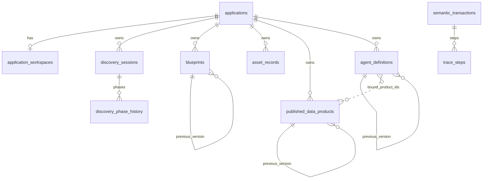

# Sprint Retrospective — Sprint 6

**Date:** 2026-06-29  
**Sprint:** Sprint 6 — Agent Definitions  
**Facilitator:** PMO (DM hat)  
**Attendees:** Product Owner, Lead Architect, Engineering offices, QA

---

## 1. Committed vs delivered

| Issue | Title | Committed | Delivered | Notes |
|-------|-------|-----------|-----------|-------|
| #103 | S6-01 Agent definition contract | Yes | Done | PR #109 |
| #104 | S6-02 Domain + migration | Yes | Done | PR #110 |
| #105 | S6-03 Agent CRUD API | Yes | Done | PR #111 |
| #106 | S6-04 Lifecycle status | Yes | Done | PR #111 |
| #107 | S6-05 Agent versioning | Yes | Done | PR #111 |
| #108 | S6-06 SemanticTransaction on create | Yes | Done | PR #111 |
| #102 | E-08 Agent definitions (epic) | Yes | Done | All children delivered |

**Delivery rate:** 6/6 committed implementation issues delivered; epic E-08 complete.

**Scope note:** `agent_runtime` execution deferred to Sprint 8 per Implementation Guide §17.

---

## 2. What went well

- **Contract-first held** — `SIP_Agent_Definition_Contract_v1.md` (DM-009, D-003, R-011) merged before gate = Yes agents PRs.
- **Full agents module** — CRUD, lifecycle, version fork, D-003 product binding, trace on create; mirrors products pattern.
- **151 pytest** green on `develop` (+21 from Sprint 5).
- **sip-dev updated** — migration `0010`, image `sip-backend:s6`, `/api/v1/agents` live in cluster OpenAPI.

---

## 3. What did not go well

- **Docker tag cache on K8s** — `sip-backend:dev` rollout did not pick up rebuilt image; required new tag `sip-backend:s6`.
- **Sprint 1 ADR backlog** (auth stub, trace orchestration) still not Accepted — carried to Sprint 7.
- **S6-03..06 bundled in one PR** — faster delivery but less granular board/PR trace than Sprint 5.

---

## 4. Governance observations (v1.0)

| # | Question | Answer |
|---|----------|--------|
| 1 | Did Decision Authority Matrix clarify who decided? | **Yes** — agent contract binding; runtime deferred per guide |
| 2 | Did Architect review only gated PRs? | **Yes** — #109 docs gate = No; #110–#111 gate = Yes |
| 3 | Did PMO avoid writing production code? | **Partial** — solo-maintainer flow |
| 4 | Did Backend avoid architecture decisions? | **Yes** — implemented against published contract |
| 5 | Was at least one PR escalated correctly? | **N/A** |
| 6 | Did event-driven architecture gate work? | **Partial** — SemanticTransaction on create; domain events deferred |

---

## 5. Process change proposals

| Proposal | Affects | Accountable approval | Action |
|----------|---------|----------------------|--------|
| Pin K8s dev image digest or versioned tag per sprint | DevOps | DevOps | **Proposed** — Sprint 7 |
| Run `ruff check` locally before push | playbook §6 | EM | **Proposed** — Sprint 7 |

---

## 6. Action items

| Action | Owner | Due | Status |
|--------|-------|-----|--------|
| Close E-08 epic #102 | DM | Sprint close | **Done** |
| Close Sprint 6 milestone | DM | Sprint close | **Done** |
| Accept MVP auth stub ADR | Architect | Sprint 7 week 1 | Open |
| Accept SemanticTransaction orchestration ADR | Architect | Sprint 7 week 1 | Open |
| Sprint 7 planning — ontology / knowledge_graph | PMO | Sprint 7 day 1 | Open |

---

## 7. Sprint 7 adjustments

- Begin **ontology** / **knowledge_graph** per Implementation Guide §17 (Sprint 6–7 knowledge phase).
- **Auth stub ADR** priority before Console or external API exposure.
- Pin `sip-backend` image tag in dev overlay after each sprint merge.

---

## 8. Office perspectives (facilitated retro)

### [Backend]

- **Well:** D-003 enforced at binding via `ConsumableProductReader` port; clean module boundary to `products`.
- **Gap:** Runtime execution still absent (`agent_runtime` Sprint 8).
- **Sprint 7:** Ontology namespace population stubs.

### [DevOps]

- **Well:** Migration `0010` applied; cluster exposes agents API.
- **Gap:** `sip-backend:dev` tag stale on Docker Desktop K8s — use versioned tags.
- **Sprint 7:** Dev overlay image tag policy.

### [QA]

- **Well:** 18 agent API tests; lifecycle, versioning, D-003 binding rejection covered.
- **Gap:** No cross-module agent create → audit-traces E2E integration test.
- **Sprint 7:** Ontology API contract tests after S7-01.

### [Architect]

- **Well:** DM-009 + ARR-002 + D-003 binding rules implemented; R-011 definition-only scope held.
- **Gap:** Auth and trace orchestration ADRs still open.
- **Sprint 7:** Ontology DM minimum contract.

---

## 9. Sprint 6 success criteria

| Criterion | Status |
|-----------|--------|
| AgentDefinition CRUD via `/api/v1/agents` scoped to Application | **Met** |
| Lifecycle Draft→Approved→Active→Versioned→Retired | **Met** |
| Version fork from Active/Versioned parent | **Met** |
| D-003 product binding validation | **Met** |
| SemanticTransaction on agent create | **Met** |
| ARR-004 no runtime assets at agent create | **Met** |
| agent_runtime module | **Deferred** — Sprint 8 |
| Sprint 1 ADR backlog | **Carried** |

---

## 10. End-user release notes

**Bu sprintte son kullanıcı için görünür bir değişiklik yok.**

Platform Console henüz yok; `/api/v1/agents` yalnızca internal REST.

---

## 11. Technical deliverables

### 1) REST endpoints

| Method | Path | PR |
|--------|------|-----|
| POST | `/api/v1/agents` | #111 |
| GET | `/api/v1/agents` | #111 |
| GET | `/api/v1/agents/{id}` | #111 |
| PATCH | `/api/v1/agents/{id}` | #111 |
| PATCH | `/api/v1/agents/{id}/status` | #111 |
| POST | `/api/v1/agents/{id}/versions` | #111 |

### 2) Data models

| Model | Table | PR |
|-------|-------|-----|
| AgentDefinition (DM-009) | `agent_definitions` | #110 |

### 3) Reports / contracts

| Document | PR |
|----------|-----|
| `SIP_Agent_Definition_Contract_v1.md` | #109 |

Operasyonel / export raporu: **Yok**.

### 4) Infrastructure

| Öğe | Detay |
|-----|--------|
| Kubernetes | `sip-backend:s6` image; migration `0010` on `sip-dev` |
| CI / GitHub | PR #109–#111 merged; 151 pytest green |
| Test suite | **151** pytest (`develop`) |

---

## 12. Database schema

### Migrations this sprint

| Revision | PR | Değişiklik |
|----------|-----|------------|
| `20260629_0010` | #110 | **`agent_definitions`** — version lineage, lifecycle alanları, `agent_definition` / `bound_product_ids` (JSONB), FK → `applications`, self-FK `previous_version_id` |

### Cumulative schema (Sprint 6 sonu)

**Alembic head:** `20260629_0010`

**Tablolar:** `alembic_version`, `applications`, `application_workspaces`, `semantic_transactions`, `trace_steps`, `discovery_sessions`, `discovery_phase_history`, `blueprints`, `asset_records`, `published_data_products`, `agent_definitions`

### Relations

`bound_product_ids` is logical JSONB (no DB FK); validated at service layer per D-003.
