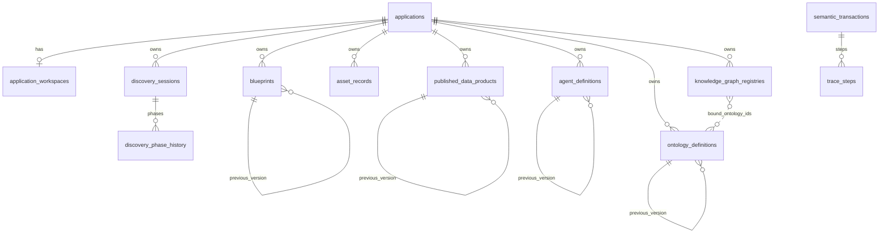

# Sprint Retrospective — Sprint 7

**Date:** 2026-06-29  
**Sprint:** Sprint 7 — Ontology & Knowledge Graph  
**Facilitator:** PMO (DM hat)

---

## 1. Committed vs delivered

| Issue | Title | Delivered | PR |
|-------|-------|-----------|-----|
| #113 | S7-01 Ontology contract | Done | #123 |
| #114–#118 | S7-02..06 Ontology module | Done | #124 |
| #119 | S7-07 KG contract | Done | #125 |
| #120–#122 | S7-08..10 Knowledge graph module | Done | #126 |
| #112 | E-09 Epic | Done | All children delivered |

**Delivery rate:** 10/10 implementation issues; epic E-09 complete.

---

## 2. What went well

- **Two modules in one sprint** — `ontology` + `knowledge_graph` with contract-first pattern.
- **Cross-module binding** — KG validates published/versioned ontologies via `PublishedOntologyReader` port.
- **164 pytest** green (+13 from Sprint 6).
- **ARR-002 lifecycles** — Ontology (6-state) and Knowledge Graph (4-state) both implemented.

---

## 3. What did not go well

- **Sprint 1 ADR backlog** still open (auth stub, trace orchestration).
- **Physical adapters** not started — Fuseki/Qdrant remain namespace-only (ARR-004).
- **Ruff SIM108** caught on first KG PR push.

---

## 4. Sprint 8 adjustments

- Begin **adapters** module (PostgreSQL, MinIO, Fuseki, Qdrant stubs) per roadmap.
- **Auth stub ADR** priority before Console.
- Pin `sip-backend:s7` image tag on cluster after merge.

---

## 9. Sprint 7 success criteria

| Criterion | Status |
|-----------|--------|
| OntologyDefinition CRUD `/api/v1/ontologies` | **Met** |
| Ontology lifecycle + version fork | **Met** |
| KnowledgeGraphRegistry CRUD `/api/v1/knowledge-graphs` | **Met** |
| KG lifecycle Created→Populated→Updated→Archived | **Met** |
| Ontology binding on KG | **Met** |
| SemanticTransaction on create (both modules) | **Met** |
| ARR-004 no runtime provisioning | **Met** |

---

## 10. End-user release notes

**Bu sprintte son kullanıcı için görünür bir değişiklik yok.**

---

## 11. Technical deliverables

### REST endpoints

| Module | Paths | PR |
|--------|-------|-----|
| ontology | `/api/v1/ontologies` CRUD, `/status`, `/versions` | #124 |
| knowledge_graph | `/api/v1/knowledge-graphs` CRUD, `/status` | #126 |

### 2) Data models

| Model | Table | PR |
|-------|-------|-----|
| OntologyDefinition | `ontology_definitions` | #124 |
| KnowledgeGraphRegistry | `knowledge_graph_registries` | #126 |

### 3) Reports / contracts

| Document | PR |
|----------|-----|
| `SIP_Ontology_Definition_Contract_v1.md` | #123 |
| `SIP_Knowledge_Graph_Contract_v1.md` | #125 |

Operasyonel / export raporu: **Yok**.

### 4) Infrastructure

| Öğe | Detay |
|-----|--------|
| Kubernetes | **Gap at sprint close** — cluster remained `sip-backend:s6`, `alembic_version=0010`; migrations `0011`–`0012` not applied on `sip-dev` until post-retro reconcile |
| CI / GitHub | PR #123–#126 merged; 164 pytest green |
| Test suite | **164** pytest (`develop`) |

---

## 12. Database schema

### Migrations this sprint

| Revision | PR | Değişiklik |
|----------|-----|------------|
| `20260629_0011` | #124 | **`ontology_definitions`** — version lineage, lifecycle alanları, `ontology_definition` (JSONB), FK → `applications`, self-FK `previous_version_id`, index `ix_ontology_definitions_application_id` |
| `20260629_0012` | #126 | **`knowledge_graph_registries`** — lifecycle alanları, `graph_metadata` / `bound_ontology_ids` (JSONB), FK → `applications`, index `ix_knowledge_graph_registries_application_id` |

### Cumulative schema (Sprint 7 sonu)

**Alembic head:** `20260629_0012`

**Tablolar:** `alembic_version`, `applications`, `application_workspaces`, `semantic_transactions`, `trace_steps`, `discovery_sessions`, `discovery_phase_history`, `blueprints`, `asset_records`, `published_data_products`, `agent_definitions`, `ontology_definitions`, `knowledge_graph_registries`

**Cluster (`sip-dev`) at sprint close:** `alembic_version = 20260629_0010` (only through Sprint 6). Tables `ontology_definitions` and `knowledge_graph_registries` existed in `develop` migrations but **not** in cluster until post-retro reconcile (2026-06-29: `alembic upgrade head` → `0012`).

### Relations

`bound_ontology_ids` is logical JSONB (no DB FK); validated at service layer.
