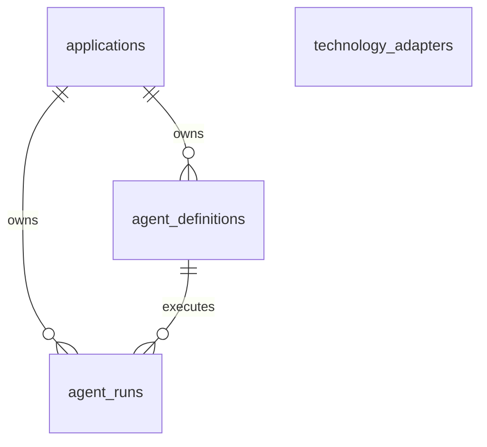

# Sprint Retrospective — Sprint 8

**Date:** 2026-06-29  
**Sprint:** Sprint 8 — Adapters & Agent Runtime  
**Facilitator:** PMO (DM hat)

---

## 1. Committed vs delivered

| Issue | Title | Delivered | PR |
|-------|-------|-----------|-----|
| #128 | S8-01 Technology adapter contract | Done | #137 |
| #129–#132 | S8-02..05 Adapters module | Done | #138 |
| #133 | S8-06 Agent runtime contract | Done | #137 |
| #134–#136 | S8-07..09 Agent runtime module | Done | #138 |
| #127 | E-11 Technology adapters epic | Done | All children delivered |

**Delivery rate:** 10/10 implementation issues; epic E-11 complete. Agent runtime (deferred from Sprint 6) delivered.

---

## 2. What went well

- **Contract-first pattern** held — two gate=No contract PRs (#137) then one gate=Yes implementation PR (#138).
- **R-018 ports** centralized under `app/shared/ports/` with dev stubs in `adapters`.
- **TD-014 resolved** — D-003 enforced at agent run start (non-empty consumable product bindings).
- **172 pytest** green (+8 from Sprint 7).

---

## 3. What did not go well

- **Branch protection** requires admin merge when self-approving PRs.
- **Physical adapter integration** still stub-only (MinIO/Fuseki/Qdrant/OpenAI clients deferred).
- **Sprint 1 ADR backlog** unchanged (auth stub TD-007, trace orchestration TD-006).

---

## 4. Sprint 9 adjustments

- Begin **governance** module per roadmap.
- **Auth stub ADR** priority before Console.
- Cluster: apply migrations `0011`–`0014`, pin `sip-backend:s8` image tag.

---

## 9. Sprint 8 success criteria

| Criterion | Status |
|-----------|--------|
| TechnologyAdapter CRUD `/api/v1/adapters` | **Met** |
| Adapter lifecycle Registered→Retired | **Met** |
| Stub port ping on Active adapters | **Met** |
| Shared ports (R-018) | **Met** |
| AgentRun stub `/api/v1/agent-runs` | **Met** |
| D-003 runtime enforcement | **Met** |
| SemanticTransaction on adapter register + agent run | **Met** |
| ARR-004 no physical provisioning | **Met** |

---

## 10. End-user release notes

**Bu sprintte son kullanıcı için görünür bir değişiklik yok.**

Platform altyapısı: teknoloji adaptör kaydı ve agent çalıştırma stub API'leri eklendi; henüz Console veya dış kullanıcı yüzeyi yok.

---

## 11. Technical deliverables

### REST endpoints

| Module | Paths | PR |
|--------|-------|-----|
| adapters | `/api/v1/adapters` CRUD, `/status`, `/ping` | #138 |
| agent_runtime | `/api/v1/agent-runs` POST, GET | #138 |

### Contracts

| Document | PR |
|----------|-----|
| `SIP_Technology_Adapter_Contract_v1.md` | #137 |
| `SIP_Agent_Runtime_Contract_v1.md` | #137 |

### Shared ports

| Port | Location |
|------|----------|
| `RelationalDBPort`, `ObjectStoragePort`, `KnowledgeGraphPort`, `VectorStorePort`, `LLMPort` | `app/shared/ports/` |

### Infrastructure

| Öğe | Detay |
|-----|--------|
| Test suite | **172** pytest |
| CI | PR #137–#138 merged |

---

## 12. Database schema

### Migrations this sprint

| Revision | PR | Değişiklik |
|----------|-----|------------|
| `20260629_0013` | #138 | **`technology_adapters`** |
| `20260629_0014` | #138 | **`agent_runs`** |

### Cumulative schema (Sprint 8 sonu)

**Alembic head:** `20260629_0014`

**Tablolar:** prior 13 domain tables + `technology_adapters`, `agent_runs`

### Relations

`technology_adapters` — platform-scoped (no `application_id` FK at MVP).

`agent_runs` — FK to `applications` and `agent_definitions`; D-003 validated via ports at service layer.
