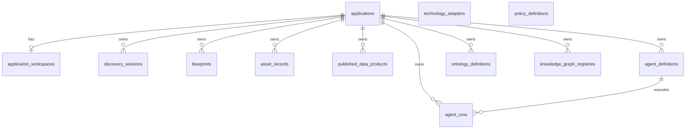

# Sprint Retrospective — Sprint 9

**Date:** 2026-06-29  
**Sprint:** Sprint 9 — Governance  
**Facilitator:** PMO (DM hat)

**Close gates:** `verify-sprint-close.ps1 -Sprint 9` **PASSED** (cluster DB + project board)

---

## 1. Committed vs delivered

| Issue | Title | Delivered | PR |
|-------|-------|-----------|-----|
| #140 | S9-01 Governance policy contract | Done | #145 |
| #141–#144 | S9-02..05 Governance module | Done | #146 |
| #139 | E-10 Epic | Done | All children delivered |

**Delivery rate:** 5/5 implementation issues; epic E-10 complete.

---

## 2. What went well

- **DM-010 PolicyDefinition** delivered platform-scoped with Draft→Retired lifecycle.
- **Sprint-close gates** caught board drift before PO handoff; repaired before milestone close.
- **176 pytest** green (+4 from Sprint 8).
- Cluster: `alembic 0015`, `sip-backend:s9`, `policy_definitions` verified on `sip-dev`.

---

## 3. What did not go well

- Sprint 9 issues were not on project board at first verify (same class of drift as Sprint 7).
- Policy **enforcement runtime** still deferred — registry only, no rule engine.
- Auth stub ADR (TD-007) still open.

---

## 4. Sprint 10 adjustments

- Begin **Assessment MVP E2E** (E-12) cross-module flow per roadmap.
- Auth stub ADR before Console.

---

## 9. Sprint 9 success criteria

| Criterion | Status |
|-----------|--------|
| PolicyDefinition CRUD `/api/v1/policies` | **Met** |
| Lifecycle Draft→Approved→Active→Retired | **Met** |
| SemanticTransaction `policy.created` | **Met** |
| ARR-004 no enforcement provisioning | **Met** |
| Sprint-close gates before PO handoff | **Met** |

---

## 10. End-user release notes

**Bu sprintte son kullanıcı için görünür bir değişiklik yok.**

---

## 11. Technical deliverables

### REST endpoints

| Module | Paths | PR |
|--------|-------|-----|
| governance | `/api/v1/policies` CRUD, `/status` | #146 |

### Contracts

| Document | PR |
|----------|-----|
| `SIP_Governance_Policy_Contract_v1.md` | #145 |

### 2) Data models

| Model | Table | PR |
|-------|-------|-----|
| PolicyDefinition (DM-010) | `policy_definitions` | #146 |

### 3) Reports / contracts

Operasyonel / export raporu: **Yok**.

### 4) Infrastructure

| Öğe | Detay |
|-----|--------|
| Kubernetes | `sip-backend:s9`; migration `0015` on `sip-dev` |
| CI / GitHub | PR #145–#146 merged |
| Test suite | **176** pytest (`develop`) |
| Close gates | `verify-sprint-close.ps1 -Sprint 9` passed |

---

## 12. Database schema

### Migrations this sprint

| Revision | PR | Değişiklik |
|----------|-----|------------|
| `20260629_0015` | #146 | **`policy_definitions`** — platform registry, `policy_key` (unique), lifecycle alanları, `policy_definition` (JSONB) |

### Cumulative schema (Sprint 9 sonu)

**Alembic head:** `20260629_0015`

**Tablolar:** `alembic_version`, `applications`, `application_workspaces`, `semantic_transactions`, `trace_steps`, `discovery_sessions`, `discovery_phase_history`, `blueprints`, `asset_records`, `published_data_products`, `agent_definitions`, `ontology_definitions`, `knowledge_graph_registries`, `technology_adapters`, `agent_runs`, `policy_definitions`

**Cluster (`sip-dev`):** `alembic_version = 20260629_0015`; verified by `verify-sprint-db.ps1 -Sprint 9`.

### Relations

`policy_definitions` — platform-scoped (no `application_id` FK at MVP).
