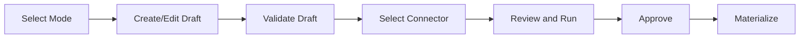
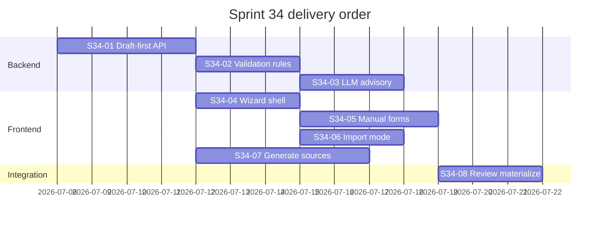

# Sprint 34 — Ontology Creation Flow v2

**Role:** Delivery Manager (PMO)  
**Date:** 2026-07-07  
**Status:** Planned  
**Epic:** E-34 (#TBD)  
**Milestone:** Sprint 34 — Ontology Creation Flow v2

---

## 1. Context

### Current state (post Sprint 32 + ad-hoc fixes)

| Area | Today |
|------|--------|
| Wizard | Manual + OWL Import only; 4 steps (Mode → Edit → Connector → Review) |
| Materialization | Happens on **import** (`POST /ontologies/import`) before validation/approve |
| Manual mode | Title, namespace, prefix, description → minimal TTL; **no class/property forms** |
| Import | File-only in UI; paste removed; parse inventory on validation page |
| Validation | RDF parse, dangling refs, unlabeled classes, optional LLM paragraph advisory |
| Lifecycle UI | Draft → Validated → Approved (3-step); list view for multiple ontologies |
| Trace steps | `validate_request`, `resolve_connector`, `persist_artifact`, … (import-centric) |
| Generate from Sources | Not implemented (S33 backlog item only) |

### Sprint 33 reconciliation

Milestone **Sprint 33 — Ontology Unified UX & Creation** (#301–#303) is **superseded** by this plan:

| Old issue | Disposition |
|-----------|-------------|
| S33-01 Route consolidation | **Mostly done** — verify & close in sprint open |
| S33-02 4-step wizard Manual/OWL | **Partially done** — fold remainder into S34-04/06 |
| S33-03 Document/Hybrid backlog | **Replaced** by S34-07 Generate from Sources |

**PMO action:** Close S33 epic after S34-01 lands or re-label S33 issues as duplicates of S34 children.

---

## 2. Goal

One **shared ontology creation lifecycle** for three entry modes. All modes produce an **Ontology Draft** first; materialization to the configured graph store happens only after validation, connector selection, review, and explicit approval.

### Shared lifecycle (UI steps)

| Step | Purpose |
|------|---------|
| Select Mode | Manual · OWL/RDF Import · Generate from Sources |
| Create/Edit Draft | Mode-specific authoring; persists Draft row + `ontology_definition` |
| Validate Draft | Deterministic validation (blocking errors + non-blocking warnings) |
| Select Connector | Active `graph_store_connector` (MVP: Fuseki-backed; UI vendor-neutral) |
| Review & Run | Summary, TTL/OWL preview, validation + LLM advisory |
| Approve | User confirms; status → Approved (pre-materialize gate) |
| Materialize | Write to connector named graph; semantic transaction + trace |

**Non-goal (MVP):** Visual ontology graph editor, reasoning engines, multi-connector fan-out.

---

## 3. Architecture notes

| Topic | Decision |
|-------|----------|
| Draft-first | **Contract change:** separate `create_draft` from `materialize`. Import endpoint must not write Fuseki until Review & Run. **Architecture gate: Yes** on S34-01. |
| `ontology_definition` | Canonical structured draft (classes, object/data properties, metadata, mode, sources). TTL generated for preview/materialize. |
| Connector abstraction | UI labels: “Graph store connector”; type filter `ontology_knowledge_graph`. No Fuseki in user-facing copy. |
| LLM review | Advisory only; structured findings; never auto-mutates draft. **Gate: No** if response schema only; **Escalate** if new LLM port contract. |
| Trace taxonomy | Align with Sprint 32 semantic transaction contract; new step types listed in §6. |

**Refs:** `SIP_Ontology_Definition_Contract_v1.md`, `SIP_Architecture_Governance_Policy.md`, ARR-002/004, R-009, API-003.

---

## 4. Committed scope (Sprint 34)

### Issue map

| ID | Title | Surface | Gate | Depends |
|----|-------|---------|------|---------|
| S34-01 | Draft-first lifecycle API — create, validate, materialize split | backend | **Yes** | — |
| S34-02 | Deterministic validation rules expansion | backend | No | S34-01 |
| S34-03 | LLM semantic review — structured advisory findings | backend | No | S34-02 |
| S34-04 | Unified wizard shell — shared 7-step flow, 3 modes | frontend | No | S34-01 |
| S34-05 | Manual mode — structured forms + TTL preview | frontend + backend | No | S34-01, S34-04 |
| S34-06 | OWL/RDF Import — file + paste, parse review, draft import | frontend + backend | No | S34-01, S34-04 |
| S34-07 | Generate from Sources — extraction draft pipeline | cross-cutting | No* | S34-01, S34-04 |
| S34-08 | Review & Run, Approve & Materialize, trace step alignment | cross-cutting | No | S34-01–03 |

\* S34-07: escalate if new ingestion ports (URL fetch, CSV) cross module boundaries.

### Stretch / Sprint 35 carryover (if capacity tight)

- S34-07 narrowed to **file + paste + app knowledge source** only; URL + CSV/Excel → Sprint 35
- LLM suggestion **accept/ignore UI** with per-finding actions → Sprint 35 if S34-03 ships findings API only

---

## 5. Acceptance by mode

### Manual

- [ ] Title, namespace, prefix, description
- [ ] Add/edit/remove **Classes** (table form)
- [ ] Add/edit/remove **Object Properties / Relationships** (domain, range)
- [ ] Add/edit/remove **Data Properties** (domain, datatype)
- [ ] Labels and descriptions per entity
- [ ] TTL/OWL preview before validation
- [ ] No visual graph editor

### OWL/RDF Import

- [ ] Upload OWL/RDF/TTL **or paste** text
- [ ] Parse + syntax validation
- [ ] Show parsed classes, properties, relationships (inventory)
- [ ] User approves parsed content → Draft (not materialized yet)
- [ ] Only approved ontology written on Materialize

### Generate from Sources

- [ ] Sources: file upload, pasted text, web URL, existing application knowledge source, CSV/Excel (stretch split per §4)
- [ ] Extract candidate concepts and relationships (LLM)
- [ ] Generate Ontology Draft
- [ ] Edit generated concepts/relationships before validation
- [ ] Review extraction evidence / source snippets per suggestion where available
- [ ] Explicit approve before materialization

### Validation (all modes)

- [ ] Required metadata: title, namespace, prefix
- [ ] Duplicate class/property names
- [ ] Invalid IRIs
- [ ] Relationship domain/range references
- [ ] Unsupported OWL/RDF syntax (import mode)
- [ ] Errors vs warnings shown separately
- [ ] **Errors block** materialization; **warnings allow** approval

### Connector

- [ ] Select configured graph store connector
- [ ] Generic UI copy (no Fuseki-specific labels)

### Review & Run

- [ ] Summary: class count, object property count, data property count, namespace, connector, validation status
- [ ] TTL/OWL preview
- [ ] **Approve & Materialize** action
- [ ] Semantic transaction + trace steps (§6)

### LLM semantic review (advisory)

- [ ] Runs after deterministic validation
- [ ] Non-blocking
- [ ] Analyzes: naming, missing concepts, duplicates/overlap, weak relationships, missing labels, domain/range clarity, coherence with application purpose
- [ ] UI: suggestions, warnings, improvement ideas
- [ ] Does **not** auto-modify ontology
- [ ] User accept/ignore per suggestion (API + trace in S34-03; full UI in S34-08 or Sprint 35)

---

## 6. Trace requirements

Single **SemanticTransaction** per ontology creation run.

| Step type | When |
|-----------|------|
| `ModeSelected` | User picks Manual / Import / Generate |
| `DraftCreated` | Draft persisted (DB) |
| `DeterministicValidationExecuted` | Structural validation completes |
| `LLMSemanticReviewExecuted` | Advisory review completes (or skipped) |
| `SuggestionAccepted` | User accepts one LLM suggestion |
| `SuggestionIgnored` | User ignores one LLM suggestion |
| `ConnectorSelected` | Graph store connector chosen |
| `OntologyApproved` | User approves for materialization |
| `OntologyMaterialized` | Artifact written to connector |

Participating assets: draft `OntologyDefinition`, connector reference, source artifacts (import file hash / source ids for Generate mode).

---

## 7. Sequencing

**Parallel after S34-01:** Backend validation/LLM + Frontend shell/manual/import/generate.

**Critical path:** S34-01 → S34-08 (deploy verify).

---

## 8. Risks

| Risk | Mitigation |
|------|------------|
| Draft-first breaks existing import flow | Feature flag or wizard-only path first; migrate OntologyStudioPage |
| Generate from Sources scope creep | MVP source types in S34-07; URL/CSV defer |
| LLM non-determinism | Advisory only; store findings snapshot on validation report |
| Architect gate delay on S34-01 | PMO prep ADR addendum draft with materialize-after-approve semantics |

---

## 9. Definition of done (sprint)

- [ ] All S34 issues **Done** on project board
- [ ] `verify-sprint-close.ps1 -Sprint 34` exit 0
- [ ] Three modes enter same wizard; all end as Draft before materialize
- [ ] Manual structured forms + Import paste/file + Generate (committed subset) demonstrable on `sip-dev`
- [ ] Trace steps §6 visible on semantic transaction detail
- [ ] Retro with §10–§12 per playbook

---

## 10. PO summary (plain language)

Kullanıcı ontology oluştururken üç yol görür: elle tanımlama, dosya/metin import, veya kaynaklardan üretme. Hepsi aynı adımları izler: taslak → doğrulama → connector seçimi → önizleme → onay → graph store’a yazma. Hatalar materialize’ı engeller; LLM önerileri sadece tavsiye verir, otomatik değiştirmez.
